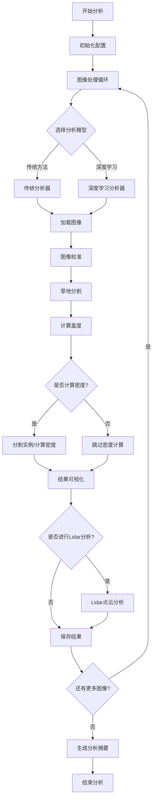
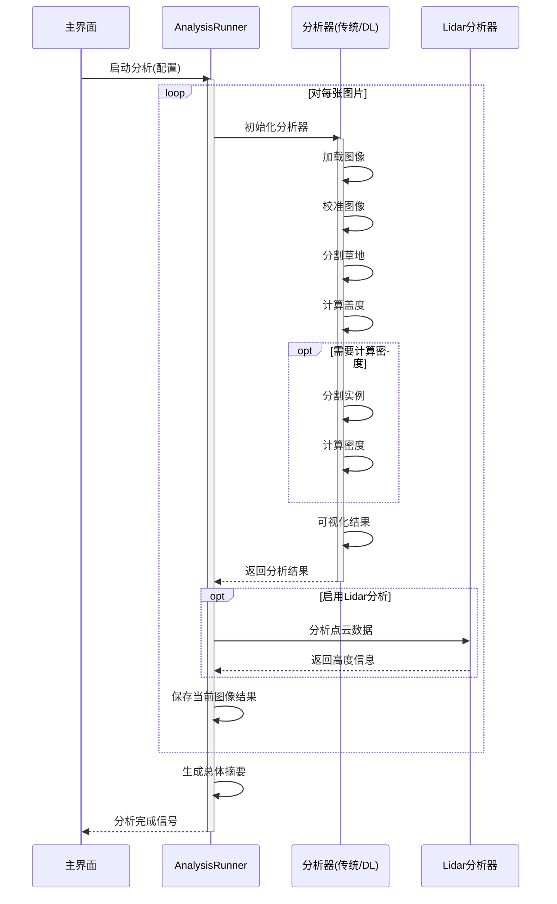
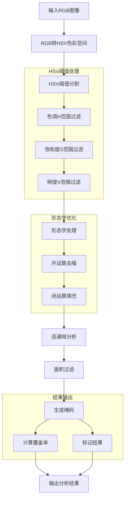

## 核心流程

```mermaid
graph TD
    A[开始分析] --> B[初始化配置]
    B --> C[图像处理循环]
    C --> D{选择分析模型}
    D -->|传统方法| E1[传统分析器]
    D -->|深度学习| E2[深度学习分析器]
    E1 --> F[加载图像]
    E2 --> F
    F --> G[图像校准]
    G --> H[草地分割]
    H --> I[计算盖度]
    I --> J{是否计算密度?}
    J -->|是| K[分割实例/计算密度]
    J -->|否| L[跳过密度计算]
    K --> M[结果可视化]
    L --> M
    M --> N{是否进行Lidar分析?}
    N -->|是| O[Lidar点云分析]
    N -->|否| P[保存结果]
    O --> P
    P --> Q{还有更多图像?}
    Q -->|是| C
    Q -->|否| R[生成分析摘要]
    R --> S[结束分析]
```

## 详细算法流程

```mermaid
sequenceDiagram
    participant UI as 主界面
    participant AR as AnalysisRunner
    participant GA as 分析器(传统/DL)
    participant LA as Lidar分析器
    
    UI->>AR: 启动分析(配置)
    activate AR
    
    loop 对每张图片
        AR->>GA: 初始化分析器
        activate GA
        
        GA->>GA: 加载图像
        GA->>GA: 校准图像
        GA->>GA: 分割草地
        GA->>GA: 计算盖度
        
        opt 需要计算密度
            GA->>GA: 分割实例
            GA->>GA: 计算密度
        end
        
        GA->>GA: 可视化结果
        GA-->>AR: 返回分析结果
        deactivate GA
        
        opt 启用Lidar分析
            AR->>LA: 分析点云数据
            LA-->>AR: 返回高度信息
        end
        
        AR->>AR: 保存当前图像结果
    end
    
    AR->>AR: 生成总体摘要
    AR-->>UI: 分析完成信号
    deactivate AR
```

## HSV分割流程

```mermaid
flowchart TD
    A[输入RGB图像] --> B[RGB转HSV色彩空间]
    B --> C[HSV阈值分割]
    
    subgraph HSV阈值处理 ["HSV阈值处理"]
        direction TB
        C --> D[色调H范围过滤]
        D --> E[饱和度S范围过滤]
        E --> F[明度V范围过滤]
    end
    
    F --> G[形态学处理]
    
    subgraph 形态学优化 ["形态学优化"]
        direction TB
        G --> H[开运算去噪]
        H --> I[闭运算填充]
    end
    
    I --> J[连通域分析]
    J --> K[面积过滤]
    K --> L[生成掩码]
    
    subgraph 结果输出 ["结果输出"]
        direction TB
        L --> M[计算覆盖率]
        L --> N[标记结果]
    end
    
    M --> O[输出分析结果]
    N --> O

```

