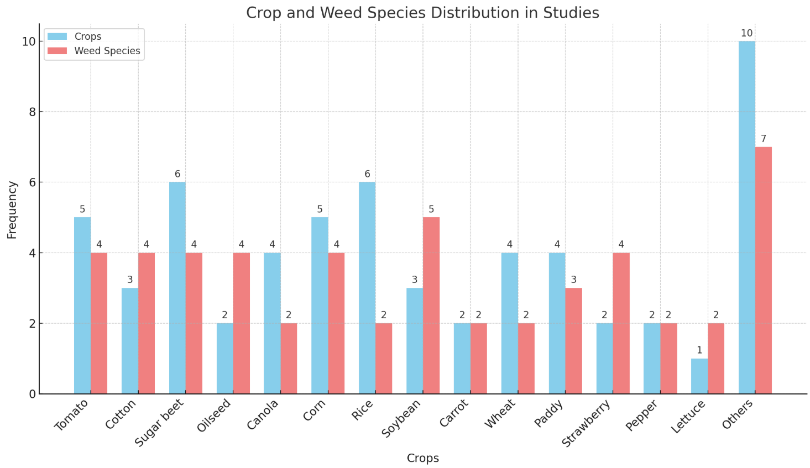
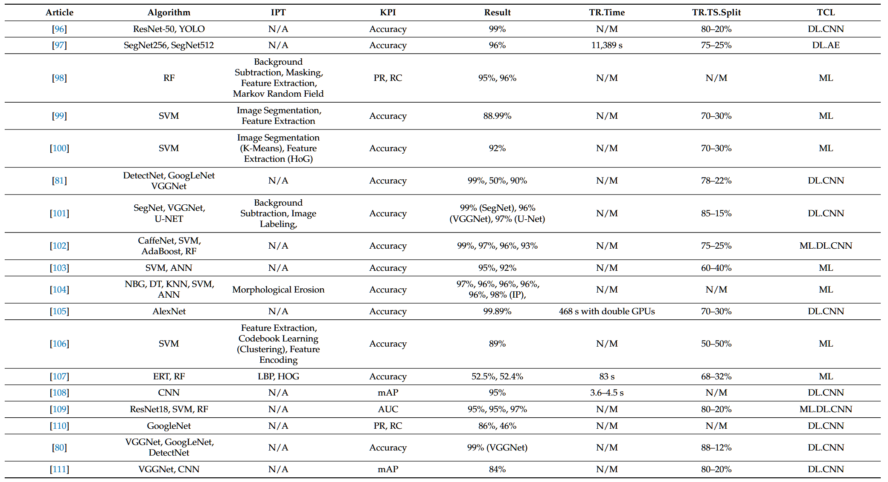

# 基于视觉与DL的杂草识别技术调研报告

## 一、相关综述文献

| 文献标题                                                                                                                                                                    | 发表时间 | 文献内容                      | 精简摘要                                                                                                                                                                 |
| ----------------------------------------------------------------------------------------------------------------------------------------------------------------------- | ---- | ------------------------- | -------------------------------------------------------------------------------------------------------------------------------------------------------------------- |
| [A Survey of Deep Learning Techniques for Weed Detection](https://arxiv.org/abs/2103.01415)                                                                             | 2021 | 二维图像杂草检测的深度学习技术的调查        | 本文综述了基于深度学习的杂草检测与分类技术，重点介绍了数据采集、数据集准备、深度学习方法以及评估指标，发现大多数研究通过对植物数据集进行预训练模型微调，利用监督学习技术在大量标注数据下实现了高准确率。                                                                 |
| [Weed Detection Using Deep Learning: A Systematic Review](https://pubmed.ncbi.nlm.nih.gov/37050730/)                                                                    | 2023 | 使用深度学习检测杂草系统文献综述          | 本文系统回顾了基于深度学习的杂草检测技术，分析了自2015年以来的研究进展，重点讨论了34种杂草类型检测、16种图像处理技术和11种深度学习算法，评估了这些算法的性能并指出SVM和CNN及其变种在准确度上表现优异，提供了该领域进一步研究的起点。                                           |
| [Deep learning techniques for in-crop weed recognition in large-scale grain production systems: a review](https://link.springer.com/article/10.1007/s11119-023-10073-1) | 2024 | 大规模谷物生产系统中的杂草识别的深度学习技术调研  | 本文综述了基于深度学习的图像杂草检测技术的最新进展，介绍了相关基础知识、公共杂草数据集的应用、面临的挑战以及未来研究的机会，旨在推动可持续的杂草控制技术发展。                                                                                      |
| [Evaluating Deep Learning Models for Effective Weed Classification in Agricultural Images](https://seer.ufrgs.br/index.php/rita/article/view/143490)                    | 2025 | 评估深度学习模型在农业图像中进行有效杂草分类的能力 | 本研究比较了ResNet-50、EfficientNet V2和Vision Transformers在使用DeepWeeds数据集进行杂草物种分类时的表现，发现数据增强显著提高了模型性能，其中EfficientNet V2在各项指标上表现最佳，最高准确率为0.9703，为农业应用中的杂草检测提供了有价值的架构选择和训练策略。 |

## 二、文献概述

### 【2021】从二维图像中对杂草检测的深度学习技术调研[^1]

根据表 Table 2.1，涉及杂草检测的深度学习方法可以从多个维度进行分析。我们可以将研究的焦点放在以下几个方面：

#### 1. 作物类型与杂草种类

- 大多数研究聚焦于农作物，如糖 beet、番茄、玉米、胡萝卜等，杂草种类从不明确到特定杂草种类不等，如夜影草、刺莓、猪毛菜等。
- 对比不同作物和杂草的研究频次，表明不同作物的杂草检测有不同的需求，尤其是当作物和杂草种类繁多时，识别的难度和准确度会受到影响。

<b>图2.1</b>不同作物中的杂草（绿色方框表示作物，红色方框表示杂草）。 

<b>图2.2</b> 作物和杂草种类分布的柱状图(2016-2020) 

#### 2. 应用的深度学习架构

- **卷积神经网络（CNN）** 是最广泛使用的架构，几乎所有研究都至少使用CNN，尤其是在YOLO、FCN、U-Net和SegNet等经典架构的基础上进行修改和优化。
- 其中，YOLO和FCN的应用频率较高，YOLO用于实时检测，而FCN则常用于图像分割任务。除此之外，VGGNet、ResNet、Inception等也在多个研究中应用于特征提取和分类任务。

<b>图2.3</b> 不同深度学习架构应用频率的水平柱状图(2016-2020) 

<b>图 2.4</b> 基于深度学习的杂草检测技术总体分类法(2016-2020) 

<b>Figure 2.4</b> An overall taxonomy of deep learning-based weed detection techniques(2016-2020) 

#### 3. 任务类型和操作类别

- 大多数研究关注**检测（DC）**，即识别并定位杂草的类别与位置。
- 其次是**图像处理（IP）**、**图像增强（IA）**和**图像分割（ILA）**等操作，这些操作常常用于提高模型的准确性和鲁棒性。
- 一些研究也探索了**基于无人机（UAV）**的图像采集、**基于边缘计算**的实时处理等创新方法。

<b>图2.5</b> 操作流程类型（如DC、IP、IA等）在杂草检测研究中的应用频率图(2016-2020) 

#### 4. 操作流程和技术

- **预处理（PBC）**和**数据增强（WM、BBA等）**等操作多次出现在表格中，说明研究者在处理原始数据时，致力于通过数据增强技术提高模型的泛化能力。

<b>表 2.1</b> 杂草检测中使用的不同DL方法的概述(2016-2020) 

<b>Table 2.1</b> An overview of different DL approaches used in weed detection(2016-2020) 

| Reference                         | Crop                                                                                                | Weed Species                                                                                                                                                                                                                                         | DL Architectures Applied                                                                                              | Operations Performed (based on Figure 5.1 ) |
| --------------------------------- | --------------------------------------------------------------------------------------------------- | ---------------------------------------------------------------------------------------------------------------------------------------------------------------------------------------------------------------------------------------------------- | --------------------------------------------------------------------------------------------------------------------- | ------------------------------------------- |
| Espejo-Garcia et al. (2020)       | Tomato, Cotton                                                                                      | Black nightshade, velvetleaf                                                                                                                                                                                                                         | Modified Xception, Inception-ResNet, VGGNet, MobileNet, DenseNet                                                      | DC; (IP, IA, ILA); PBC                      |
| A. Wang et al. (2020)             | Sugar beet, Oilseed                                                                                 | Not specified                                                                                                                                                                                                                                        | FCN                                                                                                                   | (DC, FR); (IP, IA, ILA); PBC                |
| Le et al. (2020a)                 | Canola, corn, radish                                                                                | Not specified                                                                                                                                                                                                                                        | Filtered Local Binary Pattern with Contour Mask and Coefficient k (k-FLBPCM), VGG-16, VGG-19, ResNet-50, Inception-v3 | (ATV, MC); (IP, IA, ILA); PBC               |
| Hu et al. (2020)                  | Not specified                                                                                       | Chinese apple, Lantana, Parkinsonia, Parthenium, Prickly acacia, Rubber vine, Siam weed, Snake weed                                                                                                                                                  | Inception-v3, ResNet-50, DenseNet-202, Inception-ResNet-v2, GCN                                                       | PD; 1P; PBC                                 |
| Umamaheswari and Jain (2020)      | Carrot                                                                                              | Not specified                                                                                                                                                                                                                                        | FCN                                                                                                                   | (DC, UAV); (IP, PLA); WM                    |
| H. Huang et al. (2020)            | Rice                                                                                                | Leptochloa chinensis, Cyperus iria, Digitaria sanguinalis (L.), Scop, Barnyard Grass                                                                                                                                                                 | YOLO-v3, tiny YOLO-v3                                                                                                 | DC; (IA, BBA); PBC                          |
| Gao et al. (2020)                 | Sugar beet                                                                                          | Convolvulus sepium (hedge bindweed)                                                                                                                                                                                                                  | YOLO-v3, tiny YOLO-v3                                                                                                 | DC; (IA, BBA); PBC                          |
| Sivakumar et al. (2020)           | Soybean                                                                                             | Waterhemp, Palmer amaranthus, common lambsquarters, velvetleaf, foxtail species                                                                                                                                                                      | Single-Shot Detector (SSD), Faster R-CNN                                                                              | DC; (UAV); (IP, IA, BBA); WM                |
| H. Jiang et al. (2020)            | Corn, lettuce, radish                                                                               | Cirsium setosum, Chenopodium album, bluegrass, sedge, other unspecified weed                                                                                                                                                                         | GCN                                                                                                                   | PD; (IP, ILA); PBC                          |
| Boslji et al. (2020)              | Sugar Beets, Carrots, Onions                                                                        | Not specified                                                                                                                                                                                                                                        | SegNet                                                                                                                | PD; PLA; PBC                                |
| Yan et al. (2020)                 | Paddy                                                                                               | Alternanthera philoxeroides, Eclipta prostrata, Ludwigia ascendenis, Sagittaria trifolia, Echinocloa crus-galli, Leptochloa chinensis                                                                                                                | AlexNet                                                                                                               | DC; ILA; PBC                                |
| R. Zhang et al. (2020)            | Wheat                                                                                               | Cirsium Setosum, Descurainia Sophia, Euphorbia Helioscopia, Veronica Didyma, Avena Fatu                                                                                                                                                              | YOLO-v3, tiny YOLO-v3                                                                                                 | (DC, UAV); (IP, PLA); PBC                   |
| Lottes et al. (2020)              | Sugar beet                                                                                          | Dicot weeds, grass weeds                                                                                                                                                                                                                             | FCN                                                                                                                   | MC; (IP, PLA); PBC                          |
| Trong et al. (2020)               | Not specifies                                                                                       | 12 species of "Plant Seedlings dataset", 21 species of "CNU weeds dataset"                                                                                                                                                                           | NASNet, ResNet, Inception-ResNet, MobileNet, VGGNet                                                                   | DC; ILA, PD                                 |
| Patidar et al. (2020)             | Not specified                                                                                       | Scentless Mayweed, Chickweed, Cranesbill, Shepherd’s Purse, Cleavers, Charlock, Fat Hen, Maize, Sugar beet, Common wheat, Black-grass, Loose Silky-bent                                                                                              | Mask R-CNN                                                                                                            | PD; PLA; PBC                                |
| Ramirez et al. (2020)             | Sugar beet                                                                                          | Not specified                                                                                                                                                                                                                                        | DeepLab-v3, SegNet, U-Net                                                                                             | (MC, UAV); (IP, PLA)                        |
| Osorio et al. (2020)              | Lettuce                                                                                             | Not specified                                                                                                                                                                                                                                        | YOLO-v3, Mask R-CNN, SVM                                                                                              | (IP, PLA); (DC, UAV)                        |
| Lam et al. (2020)                 | Grasslands                                                                                          | Rumex obtusifolius                                                                                                                                                                                                                                   | VGG-16                                                                                                                | (DC, UAV); (IP, IA, BBA)                    |
| Sharpe et al. (2020)              | Strawberry, Tomato                                                                                  | Goosegrass                                                                                                                                                                                                                                           | Tiny YOLO-v3                                                                                                          | (DC; BBA)                                   |
| Petrich et al. (2020)             | Not specified                                                                                       | Colchicum autumnale                                                                                                                                                                                                                                  | U-Net                                                                                                                 | (DC, FR); ILA; PBC                          |
| Czymnek et al. (2019)             | Carrot                                                                                              | Not specified                                                                                                                                                                                                                                        | Faster YOLO-v3, tiny YOLO-v3                                                                                          | (DC, FR); ILA; PBC                          |
| Partel et al. (2019b)             | Blueberry                                                                                           | Not specified                                                                                                                                                                                                                                        | Faster R-CNN, YOLO-v3, ResNet-50, ResNet-101, Darknet-53                                                              | (DC, FR); ILA; PBC                          |
| Partel et al. (2019a)             | Pepper                                                                                              | Portulaca weeds                                                                                                                                                                                                                                      | Tiny YOLO-v3, YOLO-v3                                                                                                 | (DC, UAV); (IP, IA, ILA); PBC               |
| Olsen et al. (2019)               | Not specified                                                                                       | Chinese apple, Lantana, Parkinsonia, Parthenium, Prickly acacia, Rubber vine, Siam weed, Snake weed                                                                                                                                                  | Inception-v3, ResNet-50                                                                                               | (DC, FR); (IP, ILA); PBC                    |
| Kounalakis et al. (2019)          | Clover, grass                                                                                       | Broad-leaved dock                                                                                                                                                                                                                                    | AlexNet, VGG-F, VGG-VD-16, Inception-v1, ResNet-50, ResNet-101                                                        | DC, (FR); PLA; PBC                          |
| Rasti et al. (2019)               | Mache salad                                                                                         | Not specified                                                                                                                                                                                                                                        | Scatter Transform, Local Binary Pattern (LBP), GLCM, Gabor filter, CNN                                                | DC, (FR); (IP, BBA); PBC                    |
| Sarvini et al. (2019)             | Chrysanthemum                                                                                       | Para grass, Nutsedge                                                                                                                                                                                                                                 | SVM, Artificial Neural Network (ANN), CNN                                                                             | DC, (IP, BBA); PBC                          |
| Ma et al. (2019)                  | Rice                                                                                                | Sagittaria trifolia                                                                                                                                                                                                                                  | SegNet, FCN                                                                                                           | DC, (ATV); (IP, IA, PLA); PBC               |
| Asad and Bais (2019)              | Canola                                                                                              | Not specified                                                                                                                                                                                                                                        | U-Net, SegNet                                                                                                         | DC, (IP, IA, PLA); PBC                      |
| Yu et al. (2019b)                 | Bermudagrass                                                                                        | Hydrocyte spp., Hedyotis corymbosa, Richardia scabra                                                                                                                                                                                                 | VGGNet, GoogleLeNet, DetectNet                                                                                        | DC; (IP, IA); WM                            |
| Abdalla et al. (2019)             | Oilseed                                                                                             | Not specified                                                                                                                                                                                                                                        | FCN                                                                                                                   | DC; (IA, PLA); WM                           |
| Yu et al. (2019a)                 | Perennial ryegrass                                                                                  | dandelion, ground ivy, spotted spurge                                                                                                                                                                                                                | AlexNet, VGGNet, GoogleLeNet, DetectNet                                                                               | DC; (IP, IA, PLA); PBC                      |
| Liang et al. (2019)               | Not specified                                                                                       | Not specified                                                                                                                                                                                                                                        | CNN, Histogram of oriented Gradients (HoG), LBP                                                                       | DC; (UAV); (IP, ILA); PBC                   |
| Sharpe et al. (2019)              | Strawberry                                                                                          | Carolina geranium                                                                                                                                                                                                                                    | VGGNet, GoogleLeNet, DetectNet                                                                                        | SegNet, U-Net                               |
| Fawaherji et al. (2019)           | Sunflower, carrots, sugar beets                                                                     | Not specified                                                                                                                                                                                                                                        | SegNet, U-Net, BonNet, FCN                                                                                            | DC, (FR); (PD); (IP, BBA); PBC              |
| Valente et al. (2019)             | Grassland                                                                                           | Rumex obtusifolius                                                                                                                                                                                                                                   | AlexNet                                                                                                               | DC; (UAV); (IP, BBA); PBC                   |
| Chehchinski et al. (2019)         | Beet, cauliflower, cabbage, strawberry                                                              | Not specified                                                                                                                                                                                                                                        | Hybrid Network                                                                                                        | DC; (ATV); (IP, IA, PLA); PBC               |
| Brilhador et al. (2019)           | Carrot                                                                                              | Not specified                                                                                                                                                                                                                                        | U-Net                                                                                                                 | PD; (IA, PLA); PBC                          |
| Binguitcha-Fare and Sharma (2019) | Maize, common wheat, sugar beet                                                                     | Scentless Mayweed, common chickweed, shepherd’s purse, cleavers, Redshank, charlock, fat hen, small-flowered Cranesbill, field pansy, black-grass, loose silky-bent                                                                                  | ResNet-101                                                                                                            | DC; (IP, IA, BBA); PBC                      |
| Y. Jiang et al. (2019)            | Cotton                                                                                              | Not specified                                                                                                                                                                                                                                        | Faster R-CNN                                                                                                          | DC; (IP, BBA); PBC                          |
| Adhikari et al. (2019)            | Paddy                                                                                               | Wild millet                                                                                                                                                                                                                                          | ESNet, U-Net, FCN-8s, and DeepLab-v3                                                                                  | DC; (IP, BBA); PBC                          |
| Farooq et al. (2019)              | Sugar beet                                                                                          | Alli, hyac, hyac, azol, other unspecified weeds                                                                                                                                                                                                      | DeepLab-v3, Faster R-CNN, EDNet, CNN, FCN, LBP, FCN-SPLBP                                                             | (DC, UAV); (IP, PLA); PBC                   |
| Knoll et al. (2019)               | Carrot                                                                                              | Not specified                                                                                                                                                                                                                                        | CNN                                                                                                                   | DC; (IP, PLA)                               |
| dos Santos Ferreira et al. (2019) | Soybean                                                                                             | grass, broadleaf weeds, Chinese apple, Lantana, Parkinsonia, Parthenium, Prickly acacia, Rubber vine, Siam weed, Snake weed                                                                                                                          | U-Net                                                                                                                 | DC; (IP, PLA); PBC                          |
| Rist et al. (2019)                | Not specified                                                                                       | Bama grass                                                                                                                                                                                                                                           | U-Net                                                                                                                 | SI; PBC                                     |
| Skovsen et al. (2019)             | Clover, Grass                                                                                       | Not specified                                                                                                                                                                                                                                        | FCN-8s                                                                                                                | DC, (IP, PLA); PBC                          |
| W. Zhang et al. (2018)            | Pasture                                                                                             | Not specified                                                                                                                                                                                                                                        | Inception-v3                                                                                                          | (DC, FR); BBA; PBC                          |
| Kounalakis et al. (2019)          | Grasslands                                                                                          | Broad-leaved dock                                                                                                                                                                                                                                    | AlexNet, VGG-F, GoogleLeNet                                                                                           | DC; (FR); BBA; PBC                          |
| H. Huang et al. (2018c)           | Rice                                                                                                | Common field speedwell, field pansy, common chickweed, fat-hen, fine grasses (annual meadow-grass, loose silky-bent), blackgrass, hemp-nettle, shepherd’s purse, common fumitory, cereals, brassicaceae, maize, polygonum, dead-nettle, common poppy | FCN, SVM                                                                                                              | DC; (IP, PLA); PBC                          |
| Teimouri et al. (2018)            | Not specified                                                                                       | Not specified                                                                                                                                                                                                                                        | Inception-v3                                                                                                          | DC; (IP, ILA); PBC                          |
| Umamaheswari et al. (2018)        | Carrot                                                                                              | Not specified                                                                                                                                                                                                                                        | GoogleNet                                                                                                             | PD; (IA, BBA); PBC                          |
| Suh et al. (2018)                 | Sugar beets                                                                                         | Volunteer potato                                                                                                                                                                                                                                     | AlexNet, VGG-19, GoogLeNet, ResNet-50, ResNet-101, Inception-v3                                                       | DC, ATV; (IP, IA, ILA); PBC                 |
| Farooq et al. (2018a)             | Not specified                                                                                       | Hyme, Alli, Azol, Hyac                                                                                                                                                                                                                               | ResNet-18                                                                                                             | HC; (DC, UAV); (IP, IA); PBC                |
| Bah et al. (2018)                 | Spinach, bean                                                                                       | Not specified                                                                                                                                                                                                                                        | CNN                                                                                                                   | HC; (IP, ILA); PBC                          |
| Farooq et al. (2018b)             | Not specified                                                                                       | Hyme, Alli, Azol, Hyac                                                                                                                                                                                                                               | CNN, HoG                                                                                                              | HC; (IP, ILA); PBC                          |
| Lottes et al. (2018b)             | Sugar beet                                                                                          | Galinsoga spec., Amaranthus retroflexus, Atriplex spec., Polygonum spec., Gramineae (Echinochloa crus-galli, agropyron, others.), Convolvulus arvensis, Stellaria media, Taraxacum spec.                                                             | SegNet                                                                                                                | (MC, UAV); PLA; WM                          |
| Sa et al. (2018)                  | Sugar beet                                                                                          | Not specified                                                                                                                                                                                                                                        | SegNet                                                                                                                | (MC, UAV); (IP, BBA); PBC                   |
| H. Huang et al. (2018b)           | Rice                                                                                                | Not specified                                                                                                                                                                                                                                        | CNN, FCN                                                                                                              | DC; (UAV); (IP, PLA); WM                    |
| H. Huang et al. (2018a)           | Rice                                                                                                | Not specified                                                                                                                                                                                                                                        | FCN-8s, FCN-4s, DeepLab                                                                                               | (DC, UAV); (IP, PLA); WM                    |
| Chavan and Nandedkar (2018)       | Maize, common wheat, sugar beet                                                                     | Scentless Mayweed, common chickweed, shepherd’s purse, cleavers, Redshank, charlock, fat hen, small-flowered Cranesbill, field pansy, black-grass, loose silky-bent                                                                                  | AlexNet, VGGNet, Hybrid Network                                                                                       | PD; PBC                                     |
| Nkemelu et al. (2018)             | Maize, common wheat, sugar beet                                                                     | Scentless Mayweed, common chickweed, shepherd’s purse, cleavers, Redshank, charlock, fat hen, small-flowered Cranesbill, field pansy, black-grass, loose silky-bent                                                                                  | KNN, SVM, CNN                                                                                                         | PD; (IP, BBA); PBC                          |
| Sa et al. (2017)                  | Sugar beet                                                                                          | Not specified                                                                                                                                                                                                                                        | SegNet                                                                                                                | (MC, UAV); (IP, BBA); PBC                   |
| Andrea et al. (2017)              | Maize                                                                                               | Not specified                                                                                                                                                                                                                                        | LeNet, AlexNet, cNet, sNet                                                                                            | DC; (IP, IA, PLA); PBC                      |
| Dyrmann et al. (2017)             | Winter wheat                                                                                        | Not specified                                                                                                                                                                                                                                        | FCN                                                                                                                   | (DC, ATV); (IP, BBA); PBC                   |
| dos Santos Ferreira et al. (2017) | Soybean                                                                                             | Grass, broadleaf weeds                                                                                                                                                                                                                               | AlexNet, VGGNet, Adaboost - C4.5, Random Forest                                                                       | (DC, UAV); (IP, ILA); PBC                   |
| Tang et al. (2017)                | Soybean                                                                                             | Cephalanoplos, digitaria, bindweed                                                                                                                                                                                                                   | Back propagation neural network, SVM, CNN                                                                             | DC; (IP, ILA); PBC                          |
| Milioto et al. (2017)             | Sugar beet                                                                                          | Not specified                                                                                                                                                                                                                                        | CNN                                                                                                                   | (DC, UAV); (IP, PLA); PBC                   |
| Pearlstein et al. (2016)          | Lawn grass                                                                                          | Not specified                                                                                                                                                                                                                                        | CNN                                                                                                                   | (DC, FR); ILA; BBA; PBC                     |
| Di Cicco et al. (2017)            | Sugar beet                                                                                          | Capsella bursa-pastoris, galium aparine                                                                                                                                                                                                              | SegNet                                                                                                                | SDG; PBC                                    |
| Dyrmann et al. (2016)             | Tobacco, thale cress, cleavers, common Poppy, cornflower, wheat, maize, sugar beet, cabbage, barley | Shepherd’s-Purse, chamomile, knotweed family, cranesbill, common chickweed, veronica, fat-hen, narrow-leaved grasses, field pansy, broad-leaved grasses, annual nettle, black nightshade                                                             | CNN                                                                                                                   | PD; (IP, IA); PBC                           |

### 【2023】利用深度学习进行杂草检测：系统性文献综述[^2]

#### 一、研究方法与数据概览

1. **文献筛选流程**  
   - **数据来源**：IEEE、ACM、Elsevier、Springer、Google Scholar等数据库。  
   - **筛选标准**：2015-2023年英文期刊/会议论文，最终纳入60篇（52篇应用论文+8篇综述）。  
   - **关键词策略**：组合使用“weed detection”“deep learning”“CNN”等，通过标题、摘要、内容三级过滤。  

   
   
2. **数据集特征**  
   - **主流数据集**：44个自定义数据集，3个公开数据集（IARI、CWFID、Plant Seedling）。  
   
   - **数据规模**：最大36,000张（Gold Field），最小60张（CWFID）。  
   
   - **采集方式**：无人机（13篇）、机器人（9篇）、专业相机（22篇）。  
   
   - **模态分布**：RGB（75.6%）、多光谱（11.6%）、近红外（7%）。
   
       
       
       

#### 二、核心研究进展

1. **杂草与作物关联分析**  
   - **高频作物**：糖用甜菜（13篇）、小麦（5篇）、玉米（4篇）。  
   - **高频杂草**：Dockleaf（7篇）、加拿大蓟（5篇）、Fat-hen（5篇）。  
   - **检测难点**：早期幼苗重叠（如胡萝卜与杂草颜色相似）、多年生杂草地下茎存活能力（如Paragrass）。
   - **杂草种类：**
       
       
   
2. **算法性能对比**  
   - **深度学习主导**：  
     - **CNN变种**：ResNet（最高99%）、SegNet（98%）、VGGNet（84-99%）。  
     - **目标检测模型**：YOLO（89% mAP）、SSD（86%）、Mask R-CNN（>90%）。  
   - **传统机器学习表现**：  
     - SVM（最高99%）、随机森林（97%）、Adaboost（96%）。  
   - **性能瓶颈**：VGGNet因参数量大（1.4亿）导致训练效率低。

   
<b>Table</b> Algorithmic Performance and Related Data for our application papers.

   
   
   
   
   
   
<b>Table</b> Classification of Weeds and Crops wrt Algorithms

   
   
   
3. **图像处理技术辅助**  
   
   - **预处理技术**：背景分割（5篇）、SLIC超像素（3篇）、HoG特征提取（4篇）。  
   - **关键作用**：提升模型鲁棒性，尤其在光照不均或遮挡场景（如无人机航拍）。

#### 三、技术挑战与局限性

1. **数据集问题**  
   - **标准化缺失**：各研究使用自定义数据集，分辨率（61×61至4512×3000）、标注标准不一。  
   - **多样性不足**：缺乏涵盖多气候、多生长阶段的公共基准数据集。

2. **算法泛化能力**  
   - **环境敏感性**：光照变化、土壤背景干扰导致模型跨场景性能下降（如SegNet在阴影环境下精度降低20%）。  
   - **实时性限制**：YOLO虽快（6.48 ms/帧），但复杂模型（如DeepLabV3）需GPU支持，难以部署至田间设备。

3. **多模态融合不足**  
   - 现有研究多依赖RGB图像，近红外（NIR）、高光谱数据应用较少，未能充分挖掘多源信息潜力。

#### 四、未来研究方向

1. **数据集标准化**  
   - 构建涵盖多作物-杂草组合、多生长阶段、多环境条件的开源数据集，如“WeedNet”。  
   - 推广弱监督/无监督学习，减少人工标注成本。

2. **算法优化与创新**  
   - **轻量化设计**：采用MobileNet、EfficientNet等轻量架构，适配边缘计算设备。  
   - **多任务学习**：结合语义分割（U-Net）与目标检测（YOLO），实现像素级定位与类别识别。  
   - **域适应技术**：通过GAN生成合成数据（如[134]），提升模型跨域泛化能力。

3. **多模态融合与实时系统**  
   - 整合多光谱、热成像与土壤传感器数据，构建多维特征空间。  
   - 开发嵌入式实时检测系统，如基于Jetson平台的田间机器人。

4. **农业生态整合**  
   - 结合土壤温湿度、pH值等环境参数，预测杂草爆发风险，实现精准施药。

#### 五、结论

当前基于深度学习的杂草检测研究已取得显著进展，CNN及其变种在准确率上表现突出，但数据碎片化与算法泛化能力仍是主要瓶颈。未来需聚焦数据集标准化、轻量化模型设计与多模态融合，推动技术从实验室向田间应用的转化。同时，跨学科合作（农学+计算机视觉）将成为突破复杂农业场景检测难题的关键。

<b>附</b> 高频算法性能对比表*

| 算法类别      | 代表模型       | 最高准确率   | 优势            | 局限性      |
| --------- | ---------- | ------- | ------------- | -------- |
| **CNN变种** | ResNet-50  | 99.89%  | 残差结构解决梯度消失    | 计算资源需求高  |
|           | SegNet     | 98%     | 编码-解码结构适合语义分割 | 实时性较差    |
| **目标检测**  | YOLOv3     | 89% mAP | 速度快，适合实时检测    | 小目标检测精度低 |
|           | Mask R-CNN | >90%    | 实例分割精准        | 训练复杂度高   |
| **传统ML**  | SVM（RBF核）  | 99%     | 小样本表现优异       | 特征工程依赖性强 |
|           | 随机森林       | 97%     | 抗过拟合，可解释性高    | 高维数据效率低  |

<b>*Source:</b>数据源自文中 52 篇应用论文的统计结果，准确率取各研究报道的最高值。

### 【2024】大规模谷物生产系统中的杂草识别的深度学习技术调研[^3]

#### 1. 目前二维图像基于 DL 的杂草识别方法

目前深度学习在杂草识别中的应用可分为四类架构：

<b>表 </b> 不同杂草识别方法间的比较 

<b>Table </b>  Comparisons between different weed recognition methods 

##### 1. 图像分类（Image Classification）

- **目标**：判断图像中是否存在杂草或识别具体杂草种类。
- **典型模型**：AlexNet、VGG、ResNet、DenseNet。
- **优势**：计算成本低，适合大范围快速检测。
- **局限性**：无法提供位置信息，难以支持精准除草。
- **最佳性能**：ResNet-50在DeepWeeds数据集上达到95.7%准确率。
- **挑战**：背景复杂时性能下降（如自然光变化、遮挡）。
- **改进方向**：图神经网络（GraphWeedsNet）通过区域关联提升细粒度分类，准确率达98.1%。

<b>表 </b> 基于图像分类的杂草识别研究的摘要 

<b>Table </b> Summary of image classification based weed recognition studies 

##### 2. 目标检测（Object Detection）

- **目标**：定位杂草位置（边界框）并分类。
- **典型模型**：Faster R-CNN、YOLO系列、SSD。
- **优势**：提供植物级检测，适用于中等精度除草场景。
- **局限性**：对小目标和密集杂草的检测精度不足。
- **最佳性能**：YOLOv4在草莓田中检测阔叶杂草的F1分数达95%。
- **挑战**：小目标检测（如幼苗期杂草）的召回率低。
- **改进方向**：结合多尺度特征融合（如SSD）或注意力机制。

<b>表 </b> 基于目标检测的杂草识别研究的摘要 

<b>Table </b> Summary of object detection based weed recognition studies

##### 3. 语义分割（Semantic Segmentation）

- **目标**：逐像素分类，区分杂草、作物和土壤。
- **典型模型**：U-Net、SegNet、DeepLab。
- **优势**：高精度，适合激光除草等需像素级定位的场景。
- **局限性**：计算复杂度高，实时性差。
- **最佳性能**：DeepLab-v3在甜菜田数据集上的mIoU达87.1%。
- **挑战**：实时性差（如DeepLab-v3的推理延迟达1.03秒/图像）。
- **改进方向**：轻量化模型（如MobileNet）结合知识蒸馏。

<b>表 </b> 基于语义分割的杂草识别研究的摘要 

<b>Table </b> Summary of semantic segmentation based weed recognition studies

##### 4. 实例分割（Instance Segmentation）

- **目标**：区分不同杂草个体（像素级+实例级）。
- **典型模型**：Mask R-CNN、BlendMask。
- **优势**：提供最精细的杂草信息，适合复杂场景。
- **局限性**：标注成本极高，模型复杂度大。
- **研究较少**：Mask R-CNN在特定场景下初步应用，但未解决多生长阶段杂草的泛化问题。

杂草实例分割提供了杂草识别的最高水平粒度，并提供有关像素类别的信息以及像素所属的每个杂草。与语义分割一样，该方法最有可能的用例是使用高度靶向的杂草控制处理。了解要靶向哪种杂草而不是针对每个杂草像素，将大大提高效率。已经有一些尝试部署实例分割算法以识别杂草。最近的一项研究采用了面膜R-CNN，用于两种农作物和四种杂草物种的现场RGB图像（Champ等， [2020](https://link.springer.com/article/10.1007/s11119-023-10073-1#ref-CR9) ）。通过考虑诸如不同生长阶段和小型植物的改善之类的观点，需要对这种方法进行进一步的探索。

#### 2. 性能评估指标

- **图像分类**：准确率（Accuracy）、精确率（Precision）、召回率（Recall）、F1分数。
- **目标检测**：平均精度（AP）、mAP（多类别平均精度）。
- **语义分割**：mIoU（平均交并比）、像素级准确率（mAcc）。

#### 3. 现有研究成果的实时推理情况

<b>表 </b> 实时推理和杂草检测性能的测试示例 

<b>Table </b> Examples of real-time inference latency (ms) and performance for weed detection

##### 4. 挑战与未来方向

1. **细粒度学习（Fine-grained Learning）**
    - 杂草与作物形态相似性高，需结合局部特征（叶脉、纹理）与高阶特征（空间关系）。
    - **技术路径**：区域分块（Patch-based）、高阶池化（High-order Pooling）。
2. **实时推理优化**
    - **模型压缩**：参数量化（Quantization）、二值化网络（Binarized DenseNet）。
    - **硬件适配**：FPGA部署（延迟低至1.539ms）。
3. **弱监督与无监督学习**
    - **现状**：DeepCluster在无标注数据上准确率仅70.6%。
    - **潜力**：结合图像级标注生成伪标签（如Multi-instance Learning）。
4. **可解释性学习**
    - 可视化关键区域（如GraphWeedsNet的区域注意力图）提升用户信任。
5. **大规模数据集需求**
    - 现有数据集规模小、多样性不足，需跨生长阶段、光照条件的标准化数据集。

### 【2025】评估深度学习模型在农业图像中进行有效杂草分类的能力[^4]

#### 1. 数据集

- **DeepWeeds数据集**：包含17,509张图像，涵盖8种杂草类别和1个无杂草类别。该数据集被广泛用于杂草识别研究。
- **其他数据集**：如Grass-Broadleaf、Cotton weed、Corn weed等，也被用于不同研究场景。

#### 2. 模型架构

- **Inception-v3和ResNet-50**：Olsen等人使用这些模型在DeepWeeds数据集上达到了95%的准确率。
- **Faster R-CNN**：Saleem等人使用ResNet-101作为骨干网络，在DeepWeeds数据集上达到了93.44%的准确率。
- **Swin Transformer**：Wang等人提出了一种基于Swin Transformer的细粒度杂草识别方法，在MWFI数据集上达到了99.18%的准确率。
- **CNN-SVM混合模型**：Zhang等人结合CNN和SVM，在DeepWeeds数据集上达到了97.6%的准确率。

#### 3. 数据增强与模型优化

- **数据增强**：包括随机翻转、旋转、裁剪和颜色抖动等技术，显著提高了模型的泛化能力。
- **主动学习**：Yang等人提出了一种基于差异的主动学习方法，减少了标注数据的需求，同时保持了高准确率。
- **模型压缩**：通过模型压缩技术，Yang等人将模型大小从117.9 MB压缩到8.6 MB，并在嵌入式设备上实现了实时检测。

#### 4. 研究方法与实验设计

##### 4.1 数据集与预处理

- **数据集**：使用DeepWeeds数据集，包含9个类别，共计17,509张图像。
- **数据增强**：包括随机水平翻转、旋转、裁剪、颜色抖动和随机擦除等技术。

##### 4.2 模型架构

- **ResNet-50**：引入残差连接，解决了深层网络中的梯度消失问题。
- **EfficientNet V2**：通过神经架构搜索（NAS）和渐进式学习，平衡了模型的准确性和效率。
- **Vision Transformer (ViT-b16)**：将Transformer架构应用于图像分类，捕捉图像中的长距离依赖关系。

##### 4.3 实验设置

- **训练与验证**：数据集按70%训练、15%验证、15%测试的比例划分。
- **优化器与学习率**：使用Adam优化器，初始学习率为0.0001，采用学习率调度和早停策略防止过拟合。

##### 4.4 评估指标

- **准确率（Accuracy）**：正确预测的比例。
- **精确率（Precision）**：正确预测为正类的比例。
- **召回率（Recall）**：正确识别正类的比例。
- **F1分数（F1-Score）**：精确率和召回率的调和平均数。

#### 5. 实验结果与讨论

##### 5.1 模型性能比较

- **ResNet-50**：无数据增强时准确率为95.4%，有数据增强时为95.89%。
- **EfficientNet V2**：无数据增强时准确率为96.00%，有数据增强时为97.03%。
- **ViT-b16**：无数据增强时准确率为94.89%，有数据增强时为95.37%。

##### 5.2 数据增强的影响

数据增强显著提高了所有模型的性能，特别是在EfficientNet V2上表现最为明显。数据增强通过模拟现实世界中的光照和角度变化，增强了模型的泛化能力。

##### 5.3 模型鲁棒性

EfficientNet V2在准确性和鲁棒性方面表现最佳，特别是在防止过拟合方面表现出色。ViT-b16由于对大规模数据的依赖，表现相对较差。

#### 6. 研究局限与未来方向

##### 6.1 研究局限

- **数据集限制**：DeepWeeds数据集虽然广泛使用，但其在不同农业环境中的泛化能力有限。
- **模型选择**：ViT-b16的表现相对较差，可能需要更多研究来优化其性能。
- **超参数调优**：未进行系统的超参数调优，可能影响模型性能。

##### 6.2 未来研究方向

- **跨数据集验证**：在更多杂草数据集上验证模型性能，提高泛化能力。
- **模型压缩与优化**：进一步研究模型压缩技术，以适应资源受限的农业设备。
- **高级数据增强技术**：探索如CutMix、MixUp等高级数据增强技术，进一步提高模型性能。

#### 7. 结论

本研究通过对比ResNet-50、EfficientNet V2和ViT-b16三种深度学习模型在杂草分类任务中的表现，发现EfficientNet V2在结合数据增强技术后表现最佳，准确率达到97.03%。研究结果表明，EfficientNet V2不仅在准确性上优于其他模型，还在防止过拟合方面表现出色，适合在实际农业环境中部署。未来的研究可以进一步探索其他深度学习架构、数据增强技术和模型压缩方法，以提高杂草识别的准确性和效率，推动农业的可持续发展。

### 综合调研分析

#### 1. 领域概述

精准农业正在转变传统农业实践，而杂草管理是其中的重要环节。有效的杂草检测和分类系统可以：

- 降低除草剂使用量，减少环境影响
- 提高作物产量，降低生产成本
- 优化农业资源分配，提升农业可持续性

深度学习技术的快速发展为解决传统杂草检测方法中的局限性提供了新途径，尤其是在复杂和变化的田间环境中识别杂草的能力方面。

#### 2. 技术演进和当前状态

##### 2.1 技术发展历程

深度学习在杂草检测领域的应用经历了以下几个阶段：

1. **传统计算机视觉方法**（2010年前）：依赖手工设计的特征提取和传统机器学习分类器，如支持向量机(SVM)。

2. **早期CNN模型**（2014-2017年）：采用AlexNet、VGGNet等卷积神经网络进行整体图像分类，开始超越传统方法。

3. **目标检测模型**（2017-2020年）：Faster R-CNN、YOLO、SSD等目标检测框架应用于杂草检测，能够同时定位和分类多个杂草实例。

4. **语义分割模型**（2020-2022年）：U-Net、FCN等语义分割模型实现了像素级杂草检测，显著提高了精度。

5. **高级混合模型**（2022年至今）：结合Transformer架构、多任务学习和实时性能优化的模型，如MobileNet和EfficientNet变体。

##### 2.2 主要技术方法分析

###### 图像分类模型

图像分类是最基础的深度学习方法，用于将整张图像分类为包含或不包含杂草。

- **优势**：实现简单，训练数据要求较低
- **局限性**：无法提供杂草位置信息，难以处理多种杂草同时出现的情况
- **典型模型**：AlexNet、VGGNet、ResNet、EfficientNet
- **应用场景**：简单场景下的杂草存在性判断

###### 目标检测模型

目标检测模型既可以识别杂草，又能提供其在图像中的位置信息。

- **优势**：能同时检测多个杂草实例，提供位置信息
- **局限性**：在密集杂草场景下表现受限，边界不够精确
- **典型模型**：Faster R-CNN、YOLOv3/v4/v5、SSD、RetinaNet
- **应用场景**：杂草分布稀疏的田间，需要精确定位的场景

###### 语义分割模型

语义分割提供像素级精度的杂草检测，能够准确描绘杂草轮廓。

- **优势**：最高的空间精度，适合密集和重叠杂草场景
- **局限性**：计算复杂度高，训练数据标注成本高
- **典型模型**：U-Net、SegNet、DeepLabv3+、FCN
- **应用场景**：需要精确杂草覆盖面积的精准施药系统

###### 轻量级模型

专为资源受限设备（如无人机、机器人）设计的高效模型。

- **优势**：计算效率高，适合实时应用和边缘设备
- **局限性**：精度略低于更复杂的模型
- **典型模型**：MobileNetV2/V3、EfficientDet、YOLOv5-nano
- **应用场景**：无人机实时杂草监测，农业机器人导航

###### 混合与集成方法

结合多种模型或技术以获得更好性能的方法。

- **优势**：最高的检测精度和鲁棒性
- **局限性**：系统复杂度高，资源需求大
- **典型方法**：CNN与Transformer结合、多尺度特征融合、多模型集成
- **应用场景**：复杂多变环境下的高精度杂草管理系统

#### 3. 公开数据集分析

数据集的质量和多样性是深度学习杂草检测模型性能的关键决定因素。以下是该领域主要公开数据集的分析：

##### 3.1 主要公开数据集

| 数据集名称                           | 图像数量    | 杂草/植物类别 | 标注类型 | 采集方式     | 特点          | 主要应用领域 |
| ------------------------------- | ------- | ------- | ---- | -------- | ----------- | ------ |
| DeepWeeds                       | 17,509  | 8类杂草    | 图像级  | 地面相机     | 澳大利亚杂草，多样地形 | 杂草分类   |
| Plant Seedlings Dataset         | 5,539   | 12类植物幼苗 | 图像级  | 受控环境     | 幼苗阶段，高质量图像  | 早期杂草识别 |
| Sugar Beets Dataset             | ~3,000  | 杂草与甜菜   | 像素级  | UAV & 地面 | 多时间段采集，实际田间 | 语义分割   |
| Crop/Weed Field Image Dataset   | 974     | 大豆与杂草   | 边界框  | 地面机器人    | 不同光照条件      | 目标检测   |
| WeedMap                         | 8,000   | 多种杂草    | 像素级  | 无人机      | 高分辨率正射影像    | 精确杂草图谱 |
| Open Plant Phenotyping Database | >11,000 | 多种作物与杂草 | 多种标注 | 多种平台     | 包含多传感器数据    | 多模态分析  |

##### 3.2 数据集质量与局限性分析

1. **数据多样性局限**：
   - 大多数数据集仅限于特定地区或特定作物系统
   - 环境条件（光照、土壤背景、生长阶段）变化有限
   - 杂草种类数量相对较少，缺乏罕见杂草样本

2. **标注质量挑战**：
   - 像素级标注成本高，数据集规模受限
   - 部分数据集标注存在不一致性
   - 专家与非专家标注之间存在差异

3. **实际应用差距**：
   - 实验室数据与实际农田条件存在差距
   - 时序变化（季节、生长阶段）表示不足
   - 边缘情况（极端天气、病害混合）覆盖不充分

#### 4. 性能评估与比较

##### 4.1 性能指标分析

评估深度学习杂草检测模型性能的关键指标包括：

| 性能指标       | 说明               | 重要性                |
| ---------- | ---------------- | ------------------ |
| 平均精度 (mAP) | 目标检测和分割模型的综合性能指标 | 评估模型在不同置信度阈值下的性能   |
| F1分数       | 精确率和召回率的调和平均值    | 在类别不平衡数据集中尤为重要     |
| IoU (交并比)  | 预测区域与真实区域的重叠度    | 评估分割和检测的空间精度       |
| 推理速度       | 每秒处理图像数或每图像处理时间  | 对实时应用至关重要          |
| 模型大小       | 模型参数数量和存储需求      | 影响设备兼容性和部署难度       |
| 能耗效率       | 处理单位数据所需的能量      | 对电池供电设备的持续使用时间影响显著 |

##### 4.2 主要模型性能对比

| 模型类别     | 代表模型        | 平均精度 (mAP) | 处理速度 (FPS) | 模型大小 (MB) | 典型应用场景         |
| ------------ | --------------- | -------------- | -------------- | ------------- | -------------------- |
| **图像分类** | ResNet-50       | 85-90%         | 30-40          | 98            | 简单场景杂草分类     |
|              | EfficientNet-B0 | 87-92%         | 25-35          | 29            | 资源受限设备上的分类 |
| **目标检测** | YOLOv5          | 88-94%         | 45-60          | 27-140        | 实时杂草检测系统     |
|              | Faster R-CNN    | 90-95%         | 5-10           | 250+          | 高精度研究应用       |
| **语义分割** | U-Net           | 90-95%         | 15-25          | 45-100        | 精确杂草面积测量     |
|              | DeepLabv3+      | 92-96%         | 8-15           | 150+          | 复杂场景高精度分割   |
| **轻量级**   | MobileNetV3     | 83-89%         | 60-80          | 5-20          | 移动设备和无人机应用 |
| **混合模型** | CNN+Transformer | 93-97%         | 3-8            | 200+          | 高要求研究环境       |

##### 4.3 评估中的实际挑战

在评估深度学习杂草检测模型时，研究人员面临几个关键挑战：

1. **标准化缺失**：
   - 缺乏统一的基准数据集和评估协议
   - 不同研究使用不同指标，难以直接比较
   - 测试环境多样性导致结果差异

2. **实验室与实地差异**：
   - 在受控环境中表现良好的模型在实际农田中性能可能大幅下降
   - 现有评估方法难以量化环境变化的影响
   - 很少有研究系统评估不同天气、光照和生长阶段的影响

3. **长期性能评估**：
   - 大多数研究仅关注短期性能，忽视模型随时间变化的适应性
   - 缺乏对模型更新和维护需求的评估
   - 很少考虑季节变化和多年植被动态

#### 5. 应用挑战与限制

##### 5.1 技术挑战

现有深度学习杂草检测技术面临以下关键挑战：

1. **数据需求与标注成本**：
   - 高质量标注数据获取成本高，特别是像素级分割标注
   - 杂草种类多样性难以全面覆盖
   - 数据不平衡问题（常见杂草vs罕见杂草）

2. **环境变异性适应**：
   - 光照条件变化（阴影、阳光直射、多云天气）
   - 生长阶段差异（幼苗期vs成熟期识别）
   - 跨地区和农作物系统的泛化能力有限

3. **计算资源限制**：
   - 高精度模型计算需求与边缘设备能力之间的矛盾
   - 电池寿命和能耗限制实地应用
   - 实时处理需求与复杂模型推理时间的权衡

4. **植被重叠与遮挡**：
   - 作物与杂草重叠场景下的区分难度
   - 密集生长区域中的个体分离挑战
   - 部分可见杂草的完整识别

##### 5.2 实际应用限制

从实际应用角度看，深度学习杂草检测系统面临以下限制：

1. **系统集成复杂性**：
   - 检测结果与机械控制系统的无缝集成
   - 多传感器数据融合（视觉、光谱、激光雷达）
   - 现有农业机械改造成本与兼容性
   - 决策执行闭环中的时延问题

2. **经济可行性**：
   - 高端设备初始投资大，小农场难以承担
   - 运维成本与传统除草技术相比优势不明显
   - 特定作物和地区的成本效益比差异大
   - 技术快速迭代导致投资风险

3. **农民接受度与技能要求**：
   - 技术复杂度与农民技术素养不匹配
   - 系统透明度和可解释性不足
   - 培训需求和学习曲线陡峭
   - 数据管理和隐私顾虑

4. **法规与标准化限制**：
   - 自动化农业机械相关法规不完善
   - 缺乏统一的性能和安全标准
   - 责任划分和保险问题
   - 跨境数据共享和系统认证挑战

#### 6. 未来发展趋势与机会

##### 6.1 技术发展趋势

未来几年，深度学习杂草检测技术将沿着以下几个方向发展：

1. **多模态学习与传感器融合**：
   - 结合RGB、多光谱、高光谱和深度传感器数据
   - 时序数据与空间数据集成分析
   - 融合卫星、无人机和地面传感器的多尺度分析

2. **自监督与半监督学习**：
   - 减少对大量标注数据的依赖
   - 利用未标记数据提高模型泛化能力
   - 对比学习方法在杂草特征表示中的应用

3. **高效轻量级模型设计**：

   - 专为农业设备设计的神经网络架构
   - 模型压缩、量化和知识蒸馏技术
   - 硬件感知模型优化

4. **域适应与迁移学习**：

    * 跨地区、跨作物的模型适应性研究

    * 少样本学习在新杂草种类识别中的应用

    * 农田环境变化条件下的模型稳健性增强

4. **端到端集成系统**：
    * 检测、识别和决策的一体化解决方案
    * 精准施药系统与机器人除草机的智能控制
    * 实时作物管理系统中的深度学习组件

5. **可解释人工智能**：
    * 提高模型决策透明度，增强农民信任
    * 关键杂草特征的可视化与解释
    * 基于注意力机制的决策解释技术

##### 6.2 应用拓展与商业化前景

1. **智能农业装备集成**：
   * 深度学习系统与现有农业机械的集成
   * 农用无人机和自主车辆的感知系统升级
   * 可拓展的模块化设计适应不同规模农场需求

2. **农业决策支持系统**：
   * 杂草风险预测与精准管理建议
   * 基于历史数据和实时监测的智能决策系统
   * 与其他农业管理软件的数据交互与集成

3. **数据服务与商业模式创新**：
   * 杂草识别即服务(WDaaS - Weed Detection as a Service)
   * 基于云端的农田管理解决方案
   * 按使用付费模式降低农民技术采用门槛

##### 6.3 研究与产业挑战

1. **数据获取与标注质量**：
   * 建立更全面的杂草图像数据库需要大量投入
   * 标注质量保证与标准化流程建设
   * 行业共享数据库的隐私与知识产权问题

2. **系统可靠性与极端情况处理**：
   * 恶劣天气条件下的检测可靠性
   * 新型或罕见杂草的识别能力
   * 系统故障的安全机制与降级方案

3. **技术经济性与农民接受度**：
   * 降低系统初始投资与使用成本
   * 提高系统易用性与直观性
   * 针对小规模农户的适用方案开发

#### 7. 各地区杂草检测技术应用情况比较

| 地区         | 主要应用场景                   | 技术采用水平           | 研究进展                         | 主要挑战                               | 典型案例                                        |
| ------------ | ------------------------------ | ---------------------- | -------------------------------- | -------------------------------------- | ----------------------------------------------- |
| **北美**     | 大规模谷物生产 精准农业实践 | 高 (商业化应用)     | 先进计算机视觉 农业机器人集成 | 不同地区杂草种类适应 大规模部署成本 | Blue River Technology John Deere See & Spray |
| **欧洲**     | 有机农业 减少化学品使用     | 中高 (示范与商业化) | 精确喷洒技术 可持续农业系统   | 法规合规 农田小而分散               | Ecorobotix SmartWeed                         |
| **亚洲**     | 水稻种植 小型农田           | 中 (研究与示范)     | 低成本解决方案 移动应用开发   | 多样化作物与杂草 小农户技术接受度   | 中国农科院智能管理系统 日本Kubota无人农机    |
| **澳大利亚** | 大规模旱地农业 牧场管理     | 中高 (商业化初期)   | 早期预警系统 入侵杂草管理     | 极端气候条件 广阔区域覆盖           | WeedSmart WeedSeeker                         |
| **非洲**     | 小农户 基础杂草管理         | 低 (研究与试点)     | 移动平台简化应用 低成本传感器 | 基础设施限制 技术可及性             | Hello Tractor PlantVillage                   |
| **南美**     | 大豆与甘蔗种植 热带农业     | 中 (研究与部分商用) | 特定作物系统 本地化杂草库     | 热带杂草多样性 降雨对图像质量影响   | Solinftec Agrorobótica                       |

#### 8. 案例分析：代表性深度学习杂草检测系统

##### 8.1 商业化成功案例

1. **See & Spray™ (John Deere/Blue River Technology)**
   * 技术特点：结合计算机视觉与机器学习，实时识别杂草并精准喷洒
   * 应用成效：减少除草剂使用77%，提高作物产量5-10%
   * 商业模式：设备销售与服务订阅相
   * 关键成功因素：强大技术背景与农业机械巨头的渠道优势

2. **WeedSeeker 2® (Trimble Agriculture)**
   * 技术特点：使用光学传感器与深度学习算法，区分植物与裸露土壤
   * 应用成效：减少除草剂使用达90%，适用多种作物类型
   * 商业模式：模块化设计，便于集成到现有农业设备
   * 关键成功因素：稳健的技术与易于使用的实用设计

##### 8.2 研究项目与开源系统

1. **DeepWeeds (澳大利亚昆士兰大学)**
   * 技术特点：基于深度卷积神经网络，专注澳大利亚北部杂草识别
   * 数据集规模：8种杂草，17,509张野外图像
   * 实验结果：达到95.7%的分类准确率
   * 技术贡献：公开数据集与模型，推动相关领域研究

2. **AgriML (欧盟多国合作项目)**
   * 技术特点：多模态传感器融合，适应欧洲多样化农业环境
   * 实验结果：在不同天气条件下保持80%以上识别准确率
   * 技术贡献：半监督学习算法降低数据标注需求

#### 9. 杂草检测技术的经济效益分析

##### 9.1 投资回报分析

深度学习杂草检测技术的经济收益主要体现在以下几个方面：

1. **直接经济效益**：
   * 除草剂使用减少50-90%，年均节约成本约$15-45/公顷
   * 劳动力需求减少30-60%，节约人工成本约$20-80/公顷
   * 产量提升3-8%，增加收入约$30-120/公顷

2. **间接经济效益**：
   * 减少农药使用对环境影响，降低长期环境修复成本
   * 提高作物质量，增加高端市场溢价机会
   * 降低抗除草剂杂草发展风险，避免长期管理成本上升

##### 9.2 不同规模农场的适用性分析

| 农场类型                     | 适用技术方案                                     | 初始投入           | 年化收益           | 投资回报期 | 主要挑战                                       | 推荐策略                                                 |
| ---------------------------- | ------------------------------------------------ | ------------------ | ------------------ | ---------- | ---------------------------------------------- | -------------------------------------------------------- |
| **大型农场** (>500公顷)   | 高端自动化系统 多传感器集成 自主农业机器人 | `$80,000-$200,000` | `$40,000-$100,000` | 2-3年      | 大面积数据处理 系统整合复杂性 初始投资高 | 分阶段实施 结合精准农业体系 租赁或服务模式         |
| **中型农场** (50-500公顷) | 模块化检测系统 拖拉机挂载设备 无人机监测   | `$20,000-$60,000`  | `$10,000-$30,000`  | 2-4年      | 技术适配现有设备 操作技能要求 维护支持   | 合作社共享设备 选择关键作物应用 混合服务与自有设备 |
| **小型农场** (<50公顷)    | 手持设备 简化版识别系统 共享服务模式       | `$2,000-$15,000`   | `$1,000-$8,000`    | 3-5年      | 经济可行性 技术复杂度 规模效应低         | 服务订阅模式 共享设备使用 低成本移动解决方案       |
| **专业作物农场**             | 定制化解决方案 高精度检测系统                 | `$30,000-$80,000`  | `$20,000-$60,000`  | 1-2年      | 特定作物适应性 高精度要求 季节性使用     | 针对高价值作物 与加工商合作 特殊市场定位           |

##### 9.3 技术采用障碍与克服策略

1. **初始投资门槛**：
   * 问题：系统成本高，小农户难以负担
   * 解决策略：发展租赁模式、"即服务"模式和农机共享平台

2. **技术复杂性**：
   * 问题：系统操作与维护需专业知识
   * 解决策略：简化用户界面、提供远程支持和培训服务

3. **可靠性与信任度**：
   * 问题：技术不稳定导致农民信任缺失
   * 解决策略：现场演示、分阶段应用和提供效果保证

#### 10. 总结与建议

##### 10.2 关键利益相关方行动建议

1. **研究机构与高校**：
   * 加强多学科合作，结合农学、计算机科学和工程学专业知识
   * 构建开放共享的杂草图像数据库，提高模型训练效率
   * 开发适合各地区、各类作物的专用算法与模型

2. **农业技术企业**：
   * 将研究成果转化为易用、可靠的商业产品
   * 开发多层次产品线，满足不同规模农场需求
   * 提供灵活的商业模式，降低技术采用门槛

3. **农民与农场管理者**：
   * 逐步试验和采用合适的杂草检测技术
   * 主动参与研究项目，提供真实条件反馈
   * 结合其他精准农业技术形成综合管理方案

4. **政府与政策制定者**：
   * 提供研发资金支持与技术推广激励
   * 制定明确的农业数据使用与分享规范
   * 协调科研机构与产业界合作的政策框架

##### 10.3 未来研究方向建议

1. **技术层面**：
   * 针对复杂田间环境的鲁棒性增强研究
   * 结合遥感与近地监测的多尺度杂草预警系统
   * 适合特定作物-杂草组合的专用模型开发

2. **应用层面**：
   * 智能喷洒系统与机器人除草设备的集成
   * 多年生杂草根系检测与管理方法
   * 杂草抗性早期预警与管理决策支持系统

3. **推广层面**：
   * 农民参与式设计与技术改进机制
   * 区域适应性技术解决方案
   * 多利益相关方合作平台建立

#### 11. 附录：深度学习杂草检测领域的关键数据集

| 数据集名称                  | 发布年份 | 图像数量 | 杂草种类数 | 采集环境       | 标注类型               | 特点与优势                                         | 限制因素                         | 可获取性     |
| --------------------------- | -------- | -------- | ---------- | -------------- | ---------------------- | -------------------------------------------------- | -------------------------------- | ------------ |
| **DeepWeeds**               | 2019     | 17,509   | 8          | 野外           | 分类标签               | 澳大利亚北部杂草 多样化环境条件 真实田间场景 | 地域性限制 仅分类任务         | 公开可用     |
| **Plant Seedlings Dataset** | 2018     | 5,539    | 12         | 实验室         | 分类标签               | 幼苗阶段识别 控制光照条件 多角度采集         | 非田间环境 成熟植物缺失       | 公开可用     |
| **CropWeed**                | 2020     | 2,118    | 6          | 田间           | 目标检测框 分割掩码 | 作物杂草共存 详细分割掩码 不同生长阶段       | 样本量相对较小 覆盖作物有限   | 公开可用     |
| **AgrilPlant**              | 2021     | 10,800   | 10         | 田间           | 目标检测框 分类标签 | 多种光照条件 不同拍摄角度 密集植被区域       | 主要针对欧洲杂草 标注粒度不均 | 需申请获取   |
| **WeedMap**                 | 2020     | 8,000    | 15         | 田间 无人机 | 目标检测框 密度图   | 多尺度视角 杂草密度标注 地理位置信息         | 特定区域采集 高处理需求       | 限制性共享   |
| **BoniRob**                 | 2017     | 5,673    | 3          | 田间           | 像素级分割             | 高精度分割 作物行结构 时序数据               | 杂草种类少 单一环境           | 需申请获取   |
| **Sugar Beet Weed**         | 2022     | 12,500   | 9          | 田间           | 目标检测框 分割掩码 | 针对甜菜农业 不同生长阶段 多种天气条件       | 作物单一 地域限制             | 部分公开     |
| **CWFID**                   | 2017     | 60       | 多种       | 田间           | 像素级分割             | 早期开创性数据集 详细分割 标准化拍摄         | 样本量极小 场景单一           | 公开可用     |
| **GrassClover**             | 2019     | 8,000    | 4          | 田间           | 分类标签 覆盖率估计 | 牧草与杂草混合 不同覆盖比例 密集植被         | 专用于牧场 杂草种类有限       | 公开可用     |
| **Global Weed Dataset**     | 2023     | 67,000+  | 50+        | 多环境         | 目标检测框 分类标签 | 全球范围覆盖 多样化环境 大规模标注           | 标注质量不均 部分种类样本少   | 商业使用限制 |

## 三、相关项目与数据集

### 1. 相关项目

| 项目名称                                                     | 资源链接                                                    |
| ------------------------------------------------------------ | ----------------------------------------------------------- |
| 基于YOLOv8/YOLOv7/YOLOv6/YOLOv5的田间杂草检测系统（深度学习模型+UI界面+Python代码+训练数据集） | https://www.cnblogs.com/sixuwuxian/p/18064143               |
| 基于Pycharm的YOLOv8杂草视觉检测——运行环境配置+杂草识别示例   | https://blog.csdn.net/LSS_LSS/article/details/135025853     |
| 作物与杂草的智能识别，基于YOLOv8全系列参数模型【n/s/m/lx/】开发构建田间低头作物杂草智能化检测识别模型 | https://blog.csdn.net/Together_CZ/article/details/142936451 |
| 基于深度学习的田间杂草检测系统（网页版+YOLOv8/v7/v6/v5代码+训练数据集） | https://www.cnblogs.com/deeppython/p/18097097               |
| 【改进YOLOv8】杂草识别系统：融合YOLO-MS的MS-Block改进YOLOv8  | https://zhuanlan.zhihu.com/p/671782707                      |
| CottonWeeds - Deep Transfer Learning for Weed Classification | https://github.com/DongChen06/CottonWeeds                   |
| Weed-Detection                                               | https://github.com/sharmaroshan/Weed-Detection              |

### 2. 数据集

#### 1. 开源农作物和杂草数据集

<b>数据集列表 1</b> 开源农作物和杂草数据集*

<b>Dataset List 1</b> List of publicly available crop and weed datasets*

| Dataset and Reference                                        | Type/Number of Crop         | Type/Number of Weed Species                                  | Data Type     | Sensor Mounting Vehicle | Number of Images | Data Annotation | Data Location         | Class Imbalance? |
| ------------------------------------------------------------ | --------------------------- | ------------------------------------------------------------ | ------------- | ----------------------- | ---------------- | --------------- | --------------------- | ---------------- |
| [Crop/Weed Field Image Dataset (Haug & Ostermann, 2015)](https://github.com/cwfid/dataset) | Carrot                      | Not specified                                                | Multispectral | MC and FR               | 1118             | BBA             | Latvia                | Yes              |
| [Dataset of food crops and weeds (Sudars et al., 2020)](https://pmc.ncbi.nlm.nih.gov/articles/PMC7305380/) | Six crop                    | Eight weed species                                           | RGB           | DC                      | 17,509           | ILA             | USA                   | No               |
| [DeepWeeds (Olsen et al., 2019)](https://github.com/AlexOlsen/DeepWeeds) | Not specified               | Not specified                                                | RGB           | DC                      | 30,366           | ILA             | Greece                | Yes              |
| [Early crop weed dataset (Espejo-Garcia et al., 2020)](https://github.com/AUAgroup/early-crop-weed) | Tomato, cotton              | Black nightshade, velvetleaf                                 | RGB           | DC                      | 33086            | ILA             | USA                   | No               |
| [Perennial ryegrass and weed dataset (Yu et al., 2019a)](https://www.frontiersin.org/journals/plant-science/articles/10.3389/fpls.2019.01422/full) | Perennial ryegrass          | Dandelion, ground ivy, spotted spurge                        | RGB           | DC                      | 400              | BBA             | Brazil                | Yes              |
| [Open Plant Phenotype Database (Leminen Madsen et al., 2020)](https://gitlab.au.dk/AUENG-Vision/OPPD) | Not specified               | 46 most common monocotyledon (grass) and dicotyledon broadleaved weeds | RGB           | DC                      | 7,590            | BBA             | Denmark               | No               |
| [Sugar beet and hedge bindweed dataset (Gao et al., 2020)](https://plantmethods.biomedcentral.com/articles/10.1186/s13007-020-00570-z) | Sugar beet                  | Convolvulus sepium (hedge bindweed)                          | RGB           | DC                      | 652              | BBA             | Belgium               | Yes              |
| [Sugar beet fields dataset  (Chebrolu et al., 2017))](https://www.ipb.uni-bonn.de/data/uav-sugarbeets-2015-16/) | Sugar beet                  | Not specified                                                | Multispectral | MC and FR               | 12,340           | PLA             | Germany               | No               |
| [UAV Sugarbeets 2015-16 Dataset (Chebrolu et al., 2018)](https://www.ipb.uni-bonn.de/data/uav-sugarbeets-2015-16/) | Sugarbeets                  | Not specified                                                | RGB           | DC                      | 675              | PLA             | Switzerland           | No               |
| [Corn, lettuce and weed dataset (H. Jiang et al., 2020)](https://github.com/zhangchuanyin/weed-datasets) | Corn, lettuce               | Cirsium setosum, Chenopodium album, bluegrass and sedge      | RGB           | DC                      | 1,000            | ILA             | China                 | No               |
| [Carrot-Weed dataset (Lameski et al., 2017)](https://github.com/lameski/rgbweeddetection) | Carrot                      | Not specified                                                | RGB           | DC                      | 300              | PLA             | Republic of Macedonia | Yes              |
| [Bocr-seget dataset (Le et al., 2020b)](https://academia.edu/18370526/gia01750706e491d1449f7b07638c0a1) | Canola, corn, radish        | Not specified                                                | RGB           | DC                      | 1,200            | PLA             | UK                    | Yes              |
| [Carrots 2017 dataset (Boslji et al., 2020)](https://www.researchgate.net/publication/331305594_carrot_dataset_2017) | Carrots                     | Not specified                                                | Multispectral | image MC and FR         | 30,000           | PLA             | UK                    | No               |
| [Onions 2017 dataset (Boslji et al., 2020)](https://www.researchgate.net/publication/331305594_onion_dataset_2017) | Onions                      | Not specified                                                | Multispectral | image MC and FR         | 30,000           | PLA             | UK                    | No               |
| [GrassClover image dataset (Skovsen et al., 2019)](https://vision.eng.au.dk/grass-clover-dataset/) | Red clover and white clover | Not specified                                                | RGB           | DC                      | 31,600           | ILA             | Denmark               | Yes              |
| [Leaf counting dataset (Teimouri et al., 2018)](https://vision.eng.au.dk/leaf-counting-dataset/) | Not specified               | Eighteen weed species                                        | RGB           | DC                      | 208,477          | ILA             | Republic of Korea     | No               |
| [CNU Weed Dataset (Trong et al., 2020)](https://www.sciencedirect.com/science/article/abs/pii/S0168169919319799#s0025) | Not specified               | Nine weed species                                            | DC            | DC                      | 30,000           | ILA             | Republic of Korea     | No               |
| [Plant Seedlings Dataset (Giselsson et al., 2017)](https://www.kaggle.com/datasets/vbookshelf/v2-plant-seedlings-dataset) | Three crop                  | Nine weed species                                            | DC            | DC                      | 5,539            | BBA             | Denmark               | No               |

<b>*source:</b> <a href="https://arxiv.org/abs/2103.01415">A Survey of Deep Learning Techniques for Weed Detection from Images</a>

#### 2. 用于杂草管控的开源图像数据集

<b>数据集列表 2</b> 用于杂草管控的开源图像数据集*

<b>Dataset List 2</b> Public image datasets dedicated to weed control*

| Datasets                                                     | Modality          | Platform              | Images      | Annotation                | ULR                                                          |
| :----------------------------------------------------------- | :---------------- | :-------------------- | :---------- | :------------------------ | :----------------------------------------------------------- |
| CWFI dataset ([Haug and Ostermann, 2015](https://www.sciencedirect.com/science/article/pii/S0168169920312709#b0210)) | Multispectral     | Ground vehicle        | 60          | Pixel level               | https://github.com/cwfid/dataset                             |
| Carrot-Weed ([Lameski et al., 2017](https://www.sciencedirect.com/science/article/pii/S0168169920312709#b0255)) | RGB               | Hand-holding          | 39          | Pixel level               | https://github.com/lameski/rgbweeddetection                  |
| Plant seedlings ([Giselsson et al., 2017](https://www.sciencedirect.com/science/article/pii/S0168169920312709#b0180)) | RGB               | Ground fixed platform | 407         | Image level               | https://vision.eng.au.dk/plant-seedlings-dataset/            |
| Grass-Broadleaf ([dos Santos Ferreira et al., 2017](https://www.sciencedirect.com/science/article/pii/S0168169920312709#b0130)) | RGB               | UAV                   | >10,000     | Patch level               | https://www.kaggle.com/fpeccia/weed-detection-in-soybean-crops |
| Sugar Beets 2016 ([Chebrolu et al., 2017](https://www.sciencedirect.com/science/article/pii/S0168169920312709#b0100)) | Multimodal        | Ground vehicle        | >10,000     | Image level               | https://www.ipb.uni-bonn.de/datasets_IJRR2017/annotations/   |
| Synthetic SugarBeet Weeds ([Cicco et al., 2017](https://www.sciencedirect.com/science/article/pii/S0168169920312709#b0105)) | RGB               | No imaging platform   | 8518        | Pixel level               | http://www.dis.uniroma1.it/~labrococo/fds/syntheticdatasets.html |
| weedNet ([Sa et al., 2017](https://www.sciencedirect.com/science/article/pii/S0168169920312709#b0365)) | Multispectral     | UAV                   | 465         | Image level               | https://github.com/inkyusa/weedNet                           |
| Joint stem detection ([Lottes et al., 2018](https://www.sciencedirect.com/science/article/pii/S0168169920312709#b0285)) | Multispectral+RGB | Ground vehicle + UAV  | 1321        | Pixel level               | https://www.ipb.uni-bonn.de/people/lottes/                   |
| Leaf counting ([Teimouri et al., 2018](https://www.sciencedirect.com/science/article/pii/S0168169920312709#b0415)) | RGB               | Hand-holding          | 9372        | Image level               | https://vision.eng.au.dk/leaf-counting-dataset/              |
| Weed Map ([Sa et al., 2018](https://www.sciencedirect.com/science/article/pii/S0168169920312709#b0375)) | Multispectral     | UAV                   | >10,000     | Pixel level               | [https://projects.asl.ethz.ch/datasets/doku.php?id=weedmap:remotesensing2018weedmap](https://projects.asl.ethz.ch/datasets/doku.php%3fid%3dweedmap%3aremotesensing2018weedmap) |
| DeepWeeds ([Olsen et al., 2019](https://www.sciencedirect.com/science/article/pii/S0168169920312709#b0315)) | RGB               | Ground vehicle        | >10,000     | Image level               | https://github.com/AlexOlsen/DeepWeeds                       |
| Crop weed discrimination ([Bosilj et al., 2020](https://www.sciencedirect.com/science/article/pii/S0168169920312709#bib488)) | Multispectral     | Ground vehicle        | 40          | Pixel level               | https://lcas.lincoln.ac.uk/wp/research/data-sets-software/crop-vs-weed-discrimination-dataset/ |
| Early crop weed ([Espejo-Garcia et al., 2020](https://www.sciencedirect.com/science/article/pii/S0168169920312709#b0140)) | RGB               | Hand-holding          | 508         | Image level               | https://github.com/AUAgroup/early-crop-weed                  |
| Ladybird Cobbitty Brassica ([Bender et al., 2020](https://www.sciencedirect.com/science/article/pii/S0168169920312709#b0055)) | Multimodal        | Ground vehicle        | Unspecified | No annotations            | [https://cloudstor.aarnet.edu.au/plus/S/N0giZD5QTMB32Xj?path=%2FJFR_2018](https://cloudstor.aarnet.edu.au/plus/S/N0giZD5QTMB32Xj%3fpath%3d%2FJFR_2018) |
| Open Plant Phenotype Database (OPPD) ([Madsen et al., 2020](https://www.sciencedirect.com/science/article/pii/S0168169920312709#b0295)) | RGB               | Ground fixed platform | 7590        | Image level, bounding box | https://gitlab.au.dk/AUENG-Vision/OPPD/-/tree/master/        |

<b>*source:</b> <a href="https://www.sciencedirect.com/science/article/pii/S0168169920312709">A survey of public datasets for computer vision tasks in precision agriculture</a>

#### 3. 用于水果检测的开源图像数据集

<b>数据集列表 3</b> 用于水果检测的开源图像数据集*

<b>Dataset List 3</b> Public image datasets dedicated to fruit detection*

| Datasets                                                     | Modality | Platform       | Images      | Annotation           | URL                                                          |
| :----------------------------------------------------------- | :------- | :------------- | :---------- | :------------------- | :----------------------------------------------------------- |
| DeepFruits ([Sa et al., 2016](https://www.sciencedirect.com/science/article/pii/S0168169920312709#b0370)) | RGB      | Ground based   | 587         | Bounding box         | https://drive.google.com/drive/folders/1CmsZb1caggLRN7ANfika8WuPiywo4mBb |
| Orchard Fruit ([Bargoti and Underwood, 2017a](https://www.sciencedirect.com/science/article/pii/S0168169920312709#b0025)) | RGB      | Ground vehicle | 3704        | Bounding box, circle | http://data.acfr.usyd.edu.au/ag/treecrops/2016-multifruit/   |
| Date Fruit ([Altaheri et al., 2019b](https://www.sciencedirect.com/science/article/pii/S0168169920312709#b0020)) | RGB      | Unspecified    | >10,000     | Image levels         | https://doi.org/10.21227/x46j-sk98                           |
| KFuji RGB-DS ([Gené-Mola et al., 2019b](https://www.sciencedirect.com/science/article/pii/S0168169920312709#b0175)) | RGB-D    | Ground vehicle | 967         | Bounding box         | http://www.grap.udl.cat/en/publications/KFuji_RGBDS_database.html |
| MangoNet ([Kestur et al., 2019](https://www.sciencedirect.com/science/article/pii/S0168169920312709#b0225)) | RGB      | Hand-holding   | 49          | Pixel level          | https://github.com/avadesh02/MangoNet-Semantic-Dataset       |
| MangoYOLO ([Koirala et al., 2019](https://www.sciencedirect.com/science/article/pii/S0168169920312709#b0230)) | RGB      | Ground vehicle | 1730        | Bounding box         | https://nextcloud.qriscloud.org.au/index.php/s/wvYJBt2rBX2dFJj |
| WSU apple dataset ([Bhusal et al., 2019](https://www.sciencedirect.com/science/article/pii/S0168169920312709#b0065)) | RGB      | Ground vehicle | 2298        | Bounding box         | http://hdl.handle.net/2376/17721                             |
| Fuji-SfM ([Gené-Mola et al., 2020c](https://www.sciencedirect.com/science/article/pii/S0168169920312709#b0165)) | RGB      | Ground based   | 288         | Bounding box         | http://www.grap.udl.cat/en/publications/Fuji-SfM_dataset.html |
| LFuji-air dataset ([Gené-Mola et al., 2020b](https://www.sciencedirect.com/science/article/pii/S0168169920312709#b0160)) | LiDAR    | Ground vehicle | Unspecified | Bounding box         | http://www.grap.udl.cat/en/publications/LFuji_air_dataset.html |
| MinneApple ([Häni et al., 2020b](https://www.sciencedirect.com/science/article/pii/S0168169920312709#b0205)) | RGB      | Hand-holding   | >10,000     | Pixel level          | https://conservancy.umn.edu/handle/11299/206575              |

<b>*source:</b> <a href="https://www.sciencedirect.com/science/article/pii/S0168169920312709">A survey of public datasets for computer vision tasks in precision agriculture</a>

#### 4. 专用于其他精确农业应用程序的开源图像数据集

<b>数据集列表 4</b> 专用于其他精确农业应用程序的开源图像数据集*

<b>Dataset List 4</b> Public image datasets dedicated to other precision agriculture applications*

| Dataset                                                      | Modality | Platform                      | # Images    | Annotation    | Application                           | URL                                                          |
| :----------------------------------------------------------- | :------- | :---------------------------- | :---------- | :------------ | :------------------------------------ | :----------------------------------------------------------- |
| 3D Broccoli ([Kusumam et al., 2016](https://www.sciencedirect.com/science/article/pii/S0168169920312709#b0240)) | RGBD     | Ground vehicle                | Unspecified | No annotation | Flower detection                      | https://lcas.lincoln.ac.uk/nextcloud/shared/agritech-datasets/broccoli/broccoli_datasets.html |
| Apple Trees ([Akbar et al., 2016](https://www.sciencedirect.com/science/article/pii/S0168169920312709#b0005)) | RGBD     | Hand-holding                  | Unspecified | No annotation | Tree pruning                          | https://engineering.purdue.edu/RVL/CVPRW_Dataset/            |
| Capsicum Annuum ([Barth et al., 2018](https://www.sciencedirect.com/science/article/pii/S0168169920312709#b0040)) | RGB      | No imaging platform           | >10,000     | Pixel level   | Semantic plant segmentatic            | [https://data.4tu.nl/repository/uuid:884958f5-b868-46e1-b3d8-a0b5d91b02c0](https://data.4tu.nl/repository/uuid%3a884958f5-b868-46e1-b3d8-a0b5d91b02c0) |
| Fruit flower dataset ([Dias et al., 2018](https://www.sciencedirect.com/science/article/pii/S0168169920312709#b0125)) | RGB      | Ground vehicle + hand-holding | 190         | Pixel level   | Flower detection                      | https://data.nal.usda.gov/dataset/data-multi-species-fruit-flower-detection-using-refined-semantic-segmentation-network |
| Sugarcane billets ([Alencastre-Miranda et al., 2018](https://www.sciencedirect.com/science/article/pii/S0168169920312709#b0010)) | RGB      | Ground based                  | 156         | Image level   | Damage detection                      | https://github.com/The77Lab/SugarcaneBilletsDataset          |
| Maize disease ([Wiesner-Hanks et al., 2018](https://www.sciencedirect.com/science/article/pii/S0168169920312709#b0445)) | RGB      | Multiple platforms            | >10,000     | Line level    | Disease detection                     | https://osf.io/p67rz/                                        |
| DeepSeedling ([Jiang et al., 2019](https://www.sciencedirect.com/science/article/pii/S0168169920312709#b0215)) | RGB      | Ground based                  | 5743        | Bounding box  | Seedling counting                     | https://figshare.com/s/616956f8633c17ceae9b; https://github.com/UGA-BSAIL/deepseedling |
| GrassClover ([Skovsen et al., 2019](https://www.sciencedirect.com/science/article/pii/S0168169920312709#b0400)) | RGB      | Ground based                  | >10,000     | Pixel level   | Canopy species and biomass prediction | https://vision.eng.au.dk/grass-clover-dataset                |
| Oil radish growth ([Mortensen et al., 2019](https://www.sciencedirect.com/science/article/pii/S0168169920312709#b0310)) | RGB      | Ground vehicle                | 129         | Pixel level   | Yield estimation                      | https://vision.eng.au.dk/oil-radish/                         |

<b>*source:</b> <a href="https://www.sciencedirect.com/science/article/pii/S0168169920312709">A survey of public datasets for computer vision tasks in precision agriculture</a>

## 四、相关术语及定义

### 杂草盖度

盖度是一个在生态学和植物学中常用的概念，用于描述植物覆盖地面的程度。具体来说：

1. 定义：盖度指的是植物地上部分（通常是叶片）在地面上的垂直投影面积占总样方面积的百分比。

2. 测量方法：通常通过目测或使用特定的仪器来估计植物覆盖的面积比例。

3. 应用：
   - 在生态调查中，盖度用于评估植被的密集程度和分布情况。
   - 在农业领域，盖度可以用来评估作物或杂草的生长状况。
   - 在环境保护中，盖度可以反映植被对土壤保护和生态系统功能的贡献。

4. 表示方式：通常以百分比表示，例如 50% 的盖度意味着植物覆盖了一半的地面面积。

5. 意义：
   - 盖度反映了植物群落的结构特征。
   - 它可以间接反映植物的生物量和生长状况。
   - 在杂草管理中，盖度可以用来评估杂草的严重程度和对作物的潜在影响。

6. 与密度的区别：
   - 密度通常指单位面积内植物个体的数量。
   - 盖度则关注植物覆盖的面积比例，不直接计数个体数量。

盖度是评估植被状况的重要指标之一，特别是在研究植物群落结构、生态系统功能和农业管理实践时经常使用。

### 杂草密度

1. 杂草密度可以理解为单位面积内杂草的数量或分布程度。这类似于农业中用每公顷植物数量来衡量植物密度的做法。

2. 杂草密度包括绝对密度和相对密度两种类型：

    - 绝对密度：可能指单位面积内杂草的实际数量。
    - 相对密度：可能指杂草数量与其他植物（如作物）数量的比率。

3. 有计算杂草相对密度的方法，杂草密度可以通过一定的公式或方法进行量化。

    > 1. 选择参照作物：首先需要选择一个当地常见且易于计数的作物作为参照。通常选择种植面积较大、生长均匀的作物。
    > 2. 测量参照作物株数：在参照作物生长良好的区域，随机选取几个1平方米的样方，计数每个样方内的作物株数，并计算平均值。
    > 3. 测量杂草株数：在同样的田块中，选择与参照作物相邻的相同面积的样方，计数每个样方内的杂草株数，并计算平均值。
    > 4. 计算相对密度：将杂草的平均株数除以参照作物的平均株数，得到的结果即为杂草的相对密度。公式如下： 相对密度 = (杂草平均株数 / 参照作物平均株数)

在下面一篇文献中，发现其配图涉及了密度的统计单位：株/m^2^，此计量方法采用绝对密度。

[^1]:[A Survey of Deep Learning Techniques for Weed Detection from Images](https://arxiv.org/abs/2103.01415)
[^2]: [Weed Detection Using Deep Learning: A Systematic Literature Review](https://pubmed.ncbi.nlm.nih.gov/37050730/)
[^3]: [Deep learning techniques for in-crop weed recognition in large-scale grain production systems: a review](https://link.springer.com/article/10.1007/s11119-023-10073-1)
[^4]: [Evaluating Deep Learning Models for Effective Weed Classification in Agricultural Images](https://seer.ufrgs.br/index.php/rita/article/view/143490)
[^5]: [A survey of public datasets for computer vision tasks in precision agriculture](https://www.sciencedirect.com/science/article/pii/S0168169920312709)

