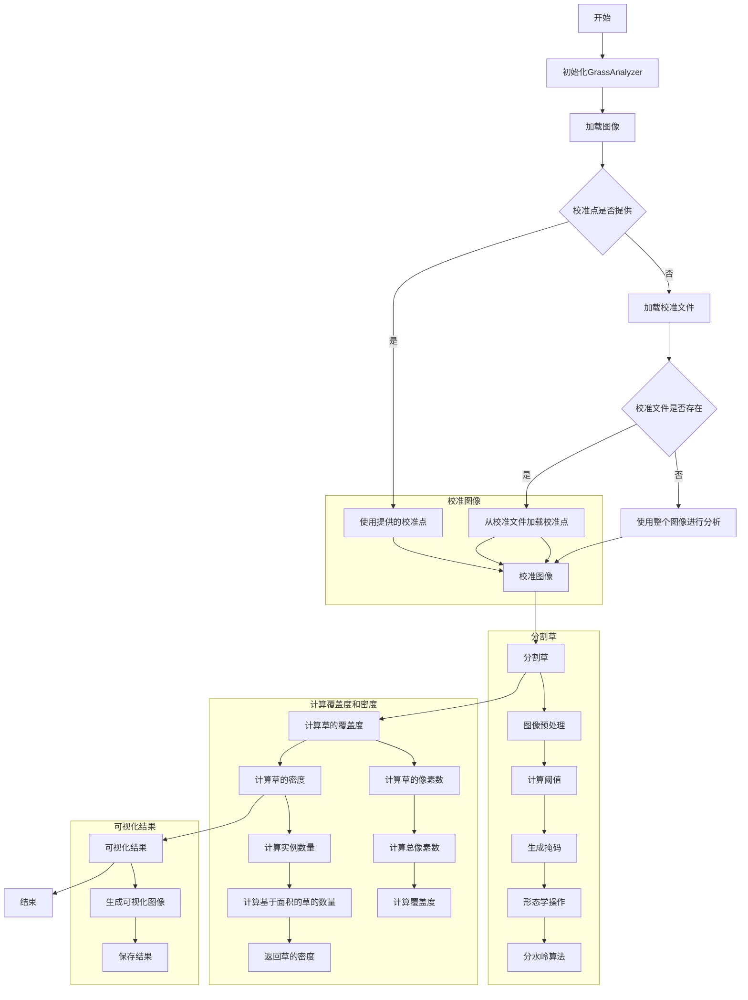

# 杂草盖度与密度估计项目进展报告

### 传统方案

1. **图像校准**：使用透视变换将选定的四边形区域转换为标准的 500x500 像素正方形，代表 1 平方米区域。
2. **草的分割**：HSV 方法：基于 **HSV** 颜色空间的阈值分割，适用于草与背景颜色对比明显的情况
3. **盖度计算**：草的像素数 / 总区域像素数 × 100%
4. **密度计算**：使用**分水岭算法**进行实例分割，计算草的实例数量

#### 方案细节

```mermaid
%%{init: {
  'theme': 'base',
  'themeVariables': {
    'primaryColor': '#4285F4',
    'primaryTextColor': '#ffffff',
    'primaryBorderColor': '#2a75f3',
    'lineColor': '#555555',
    'secondaryColor': '#34A853',
    'tertiaryColor': '#FBBC05',
    'fontFamily': 'Microsoft YaHei, Arial, sans-serif',
    'fontSize': '16px',
    'curve': 'basis'
  },
  'flowchart': {
    'htmlLabels': true,
    'curve': 'basis',
    'diagramPadding': 20
  }
}}%%

flowchart TB
    %% 定义现代化高级样式
    classDef processClass fill:#E3F2FD,stroke:#1E88E5,stroke-width:2px,color:#0D47A1,rx:8,ry:8
    classDef decisionClass fill:#FFF8E1,stroke:#FFA000,stroke-width:2px,color:#E65100
    classDef dataClass fill:#E8F5E9,stroke:#43A047,stroke-width:2px,color:#1B5E20,rx:12,ry:12
    classDef startClass fill:#651FFF,color:white,stroke:#4527A0,stroke-width:2px,rx:20,ry:20
    classDef endClass fill:#2979FF,color:white,stroke:#1565C0,stroke-width:2px,rx:20,ry:20
    classDef noteClass fill:#FFF3E0,stroke:#FF6E40,stroke-width:1px,color:#BF360C,stroke-dasharray:5,5,rx:4,ry:4
    classDef subgraphClass fill:#FAFAFA,stroke:#BDBDBD,stroke-width:1px,color:#424242,rx:10,ry:10
    
    %% 开始节点
    Start([" 🚀 开始杂草分析 "]):::startClass
    
    %% 图像预处理阶段
    subgraph PreProcess[" 📸 1. 图像预处理 "]
        direction TB
        Load[" 加载图像<br><i>cv2.imread</i> "]:::processClass
        Calibrate[" 图像校准<br><i>透视变换校正</i> "]:::processClass
        
        Load --> |" 原始图像 "| Calibrate
        
        style PreProcess fill:#E3F2FD,stroke:#1976D2,stroke-width:2px,rx:15,ry:15
    end
    
    %% 草地分割阶段
    subgraph Segmentation[" 🌿 2. 草地分割 "]
        direction TB
        HSV[" 转换为HSV颜色空间<br><i>增强绿色区分度</i> "]:::processClass
        AdaptiveThresh[" 自适应阈值分割<br><i>cv2.inRange</i> "]:::processClass
        Morphology[" 形态学操作<br><i>开运算和闭运算</i> "]:::processClass
        RemoveSmall[" 移除小区域<br><i>connectedComponents</i> "]:::processClass
        HSVMask[(" 生成HSV掩码<br><i>二值图像</i> ")]:::dataClass
        
        HSV --> |" 颜色转换 "| AdaptiveThresh
        AdaptiveThresh --> |" 初步分割 "| Morphology
        Morphology --> |" 优化边界 "| RemoveSmall
        RemoveSmall --> |" 过滤噪声 "| HSVMask
        
        style Segmentation fill:#E0F2F1,stroke:#00897B,stroke-width:2px,rx:15,ry:15
    end
    
    %% 盖度计算阶段
    subgraph Coverage[" 📊 3. 盖度计算 "]
        direction TB
        CountGrass[" 计算草的像素数<br><i>np.sum(hsv_mask > 0)</i> "]:::processClass
        CountTotal[" 计算总像素数<br><i>hsv_mask.size</i> "]:::processClass
        CalcCoverage[" 计算盖度百分比<br><i>grass_pixels / total_pixels * 100</i> "]:::processClass
        CoverageResult[(" 盖度结果<br><i>百分比</i> ")]:::dataClass
        
        CountGrass --> |" 前景像素 "| CountTotal
        CountTotal --> |" 总像素 "| CalcCoverage
        CalcCoverage --> CoverageResult
        
        style Coverage fill:#F3E5F5,stroke:#8E24AA,stroke-width:2px,rx:15,ry:15
    end
    
    %% 实例分割阶段
    subgraph InstanceSeg[" 🔍 4. 实例分割 "]
        direction TB
        PreprocessMask[" HSV掩码预处理<br><i>增强连通性</i> "]:::processClass
        DistTransform[" 距离变换<br><i>cv2.distanceTransform</i> "]:::processClass
        
        MethodChoice{" 选择分割方法 "}:::decisionClass
        Watershed[" 分水岭算法<br><i>cv2.watershed</i> "]:::processClass
        LocalMax[" 局部极大值方法<br><i>peak_local_max</i> "]:::processClass
        
        RemoveInstances[" 移除小实例<br><i>面积过滤</i> "]:::processClass
        Instances[(" 生成实例标记<br><i>唯一ID标识</i> ")]:::dataClass
        
        PreprocessMask --> |" 预处理 "| DistTransform
        DistTransform --> |" 距离图 "| MethodChoice
        MethodChoice -->|" 复杂形状 "| Watershed
        MethodChoice -->|" 简单形状 "| LocalMax
        Watershed --> |" 标记图 "| RemoveInstances
        LocalMax --> |" 标记图 "| RemoveInstances
        RemoveInstances --> |" 过滤 "| Instances
        
        style InstanceSeg fill:#FFF3E0,stroke:#F57C00,stroke-width:2px,rx:15,ry:15
    end
    
    %% 密度计算阶段
    subgraph Density[" 📈 5. 密度计算 "]
        direction TB
        ChooseMethod{" 选择密度<br>计算方法 "}:::decisionClass
        
        InstanceCount[" 基于实例计数<br><i>计算唯一标签数量</i> "]:::processClass
        AreaBased[" 基于面积估计<br><i>grass_area / avg_plant_size</i> "]:::processClass
        Combined[" 组合方法<br><i>权重结合两种方法</i> "]:::processClass
        DensityResult[(" 密度结果<br><i>株/平方米</i> ")]:::dataClass
        
        ChooseMethod -->|" 分离良好 "| InstanceCount
        ChooseMethod -->|" 重叠严重 "| AreaBased
        ChooseMethod -->|" 混合情况 "| Combined
        InstanceCount --> DensityResult
        AreaBased --> DensityResult
        Combined --> DensityResult
        
        style Density fill:#E8F5E9,stroke:#43A047,stroke-width:2px,rx:15,ry:15
    end
    
    %% 结束节点
    End([" 🏆 输出最终结果:<br>盖度百分比 + 密度估计 "]):::endClass
    
    %% 主流程连接 - 使用曲线连接增强现代感
    Start -.-> PreProcess
    PreProcess -.-> Segmentation
    Segmentation -.-> |" 分叉处理 "| HSVMask
    HSVMask -.-> |" 计算占比 "| Coverage
    HSVMask -.-> |" 实例识别 "| InstanceSeg
    Coverage -.-> |" 盖度数据 "| End
    InstanceSeg -.-> |" 实例数据 "| Density
    Density -.-> |" 密度数据 "| End

    %% 添加说明注释 - 使用现代化的图标和格式
    subgraph Parameters[" ⚙️ 关键参数说明 "]
        direction TB
        HSVNote[" 🎨 HSV阈值:<br>• H: 35-90 (绿色)<br>• S: >40<br>• V: >25 "]:::noteClass
        MorphNote[" 🔧 形态学参数:<br>• kernel_size = 5x5<br>• iterations = 1 "]:::noteClass
        MinSizeNote[" 📏 最小区域阈值:<br>• min_size = 50 * (image_size/250000) "]:::noteClass
        DensityNote[" 📊 密度估计策略:<br>• 实例计数: 分离良好时<br>• 面积估计: 重叠严重时<br>• 组合方法: 混合情况 "]:::noteClass
        
        style Parameters fill:#FAFAFA,stroke:#9E9E9E,stroke-width:1px,rx:15,ry:15
    end
```

#### 效果演示

### 深度学习方案

> [!note]
>
> 该方法欲想达到较好的识别效果预测需要使用目标数据集进行针对训练

1. **图像校准**：与传统方法相同，使用透视变换。

2. **草的分割**：

    - 使用预训练的 DeepLabV3 ResNet50 模型进行语义分割
    - 结合多种颜色空间（HSV、LAB）和 K-means 聚类进行增强分割
    - 自适应参数调整：根据图像特性自动调整分割参数
    - 多模型集成：结合深度学习预测和颜色特征

3. **盖度计算**：与传统方法相同，基于分割掩码计算。

4. **密度计算**：
    - 使用连通组件分析估计草的数量
    - 对于复杂场景，使用距离变换和局部极大值检测进行增强估计
    - 自动过滤小区域，提高密度估计准确性

5. **自适应机制**：
    - 自动检测过度分割，并应用更严格的分割条件
    - 根据图像特性自动调整 HSV 阈值和其他参数
    - 多种备用策略，确保在各种场景下都能得到合理结果

## 当前估计结果（传统方法）

| 数据文件 | 盖度 (%) | 密度 (株/平方米) |
| :------: | :------: | :--------------: |
|  00001   |  41.18   |        72        |
|  00002   |  51.24   |        73        |
|  00003   |  51.88   |        67        |
|  00004   |  50.46   |        55        |
|  00005   |  46.53   |        70        |
|  00006   |  48.34   |        62        |
|  00007   |  33.88   |        78        |
|  00008   |  42.93   |        84        |
|  00009   |  37.14   |        60        |
|  000010  |  40.24   |        55        |
|  000011  |  45.05   |        87        |
|  000012  |  45.71   |        81        |

00001

00002

00003

00004

00005

00006

00007

00008

00009

000010

000011

000012

